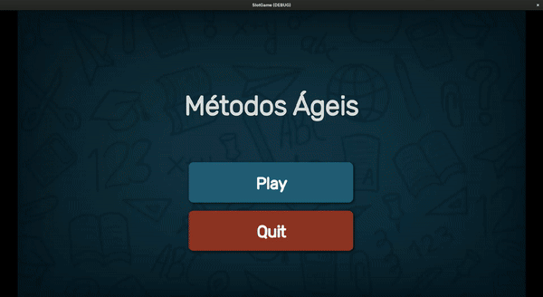

# Agile Trivia Challenge  ~~Slot Game~~
A trivia game that tests your knowledge of agile methodologies! This game offers a fun and educational way to learn about Kanban, Scrum, XP, Lean, TDD, and the Agile Manifesto.

Check it on [itch.io](https://luiz734.itch.io/agile-trivia-challenge)

### This game is not in english

## How to Play
- Answer multiple-choice questions about agile methodologies.
- Each correct answer earns points and advances your progress in the game.
- Use boosts and extra features to enhance your performance.
- Choose questions based on varying difficulty and topics. 

## Features
- 36 diverse and challenging questions.
- Intuitive and user-friendly interface for mobile devices.
- Clear and straightforward scoring system
